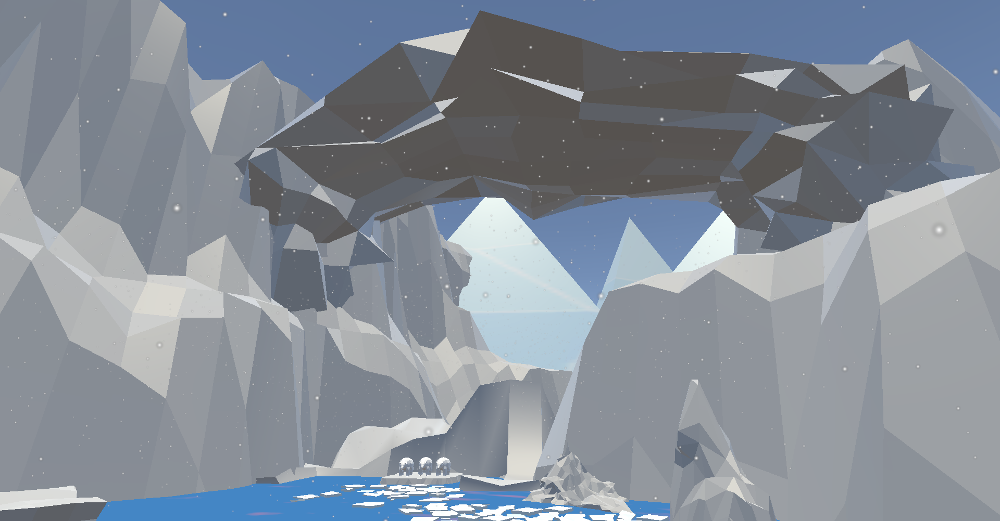

# North Bear

Video:

The effects of climate change are becoming increasingly difficult to deny. Canada’s Arctic region is warmer than ever previously on record and this is having an undeniable effect on the environment and wildlife of the north. In many legends and mythologies, bear and humans are closely linked, often represented as humans who have transformed into bears and as the keepers of wisdom and teachers.
 

Project North Bear asks participants to step into the DreamTime and allow themselves to be transformed into this mythological manifestation of Polar Bear and Human as one, interchangeable, and to experience a struggle with a dwindling arctic habitat and to search for solutions through cooperative play and a symbolic rebuilding of the environment around them.
 

Samuel Bebenek, Duna Al Jaberi, Lamisa Ashiq, Sam Bebenek, Marion Cabiles, Jason Chen, Basma El-Bahnasawy, Nick Erkelenz, Aubrey Garcia, Amanda Guido, Vivien Hung, Kyle Irizawa, Zhuoxuan Li, Paul Liu, Ann Nguyen, __Jeremy Nguyen__, Nam Nguyen, Phuc Pham, Dale Rosen, Colin Ruan, Zach Shron, Raymond Wan

__Collaborative Project Development__  
DATT3700  
York University - Toronto  
2017  

__Showings:__  
Digital Media - Arts and Culture 2017. York University, Toronto  
Digital Media Exhibition 2017: Play Palace. Inter/Access Gallery, Toronto  
